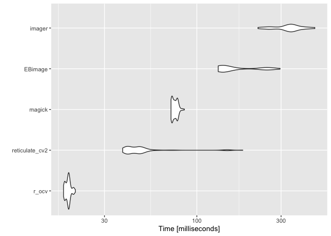

##### [Python環境構築](memo.html)→初めてのreticulate(ｲﾏｺｺ)

## 要件

**reticulate**パッケージを使ってR上でPythonを使う。

## Python側の準備

[環境構築](memo.html)を参照。

`Pipenv`で作った仮想環境が入ったフォルダに移動し、インタープリタのpathを確認。


```bash
cd <hoge>/project   # 移動
pipenv shell        # 環境に入る
pipenv --venv       # pathを確認
```

Macでは`<hoe>/project/.venv`となる。

インタープリタのアドレスは`<hoe>/project/.venv/bin/python`となる。

仮想環境中にインストールされているパッケージを確認。


```bash
pipenv run pip freeze
```

ここに**numpyがある**ことが必須。

ない場合は、インストールしておく。


```bash
pipenv install numpy
```

proxy下なら、install前にshellした状態でpathを通しておく。

```bash
export HTTP_PROXY=http://my-proxy-server:port
export HTTPS_PROXY=http://my-proxy-server:port
```

## R側の準備

パッケージのインストール


```r
install.packages("tidyverse")   # 初心者は黙って入れよう 上級者はお好きに
install.packages("reticulate")  # R上でPythonを呼び出すインターフェース
```

インストールされているパッケージにattach


```r
library(tidyverse)
library(reticulate)
```

## reticulateことはじめ

#### pathを通して仮想環境を呼び出す。

使いたいPythonインタープリタのpathを変数に取っておいて呼び出す。


```r
python_env <- "<hoge>/project/.venv/bin/python"

use_python(python = python_env, required = TRUE)
```


確認。


```r
py_config()
```

こんな感じの出力になる(はず)。


```eval
## python:         <hoge>/project/.venv/bin/python
## libpython:      /Library/Frameworks/Python.framework/Versions/3.7/lib/python3.7/config-3.7...
## pythonhome:     /Library/Frameworks/Python.framework/Versions/3.7:/Library/...
## virtualenv:     <hoge>/project/.venv/bin/activate_this.py
## version:        3.7.4 (v3.7.4:e09359112e, Jul  8 2019, 14:36:03) ...
## numpy:         <hoge>/project/.venv/lib/python3.7/site-packages/numpy
## numpy_version:  1.16.4
## 
## NOTE: Python version was forced by use_python function
```

**注意**： 一度、Pythonのインタプリタを読み込むと、そのセッションでは異なるインタプリタを上書きして指定することはできない。切り替えたい場合はRを再起動(`command + shift + 0`)するなどして、セッションをリフレッシュする必要がある。

また、インタープリタの読み込みにはAnacondaに対応した`use_condaenv`や、virturalenvに対応した`use_virtualenv`という専用の関数があるが、ここでは推奨しない（Piperを使っていれば不要）。

#### Pythonで定義した関数をR上で使う


Python側で定義した関数を`./python/sample.py`に入れておく。\
(最近のRstudioではFile > NewFileからPython Scriptを選べる)

例えば下記。


```python
import pandas as pd

def pd_load_csv(path):
  df = pd.read_csv(path)
  return df
  
def pd_head3(df):
  return df.head(3)

def pd_head(df, n = 3):
  return df.head(n)
```

これを使ってデータを変形してみる。

適当なcsvを作っておいて、


```r
set.seed(71)
N <- 15
data.frame(x = 1:N,
           y = rnorm(N),
           z = sample(letters[1:3], N, replace = TRUE)) %>% 
  write.csv("data/sample1.csv", row.names = F)
```

PythonScript上で定義した関数を使って読み込む。


```r
source_python("python/sample.py")

path <- "data/sample1.csv" 

path %>% 
  pd_load_csv() %>% 
  pd_head3()
```

```
##   x          y z
## 1 1 -0.4318422 a
## 2 2 -0.4471872 b
## 3 3 -0.4785726 c
```

できた！

#### 注意点


ところが、どっこい、これ↓がエラーになる。


```r
path %>% 
  pd_load_csv() %>% 
  pd_head(3)
```

>  py_call_impl(callable, dots$args, dots$keywords) でエラー: 
  TypeError: cannot do slice indexing on <class 'pandas.core.indexes.range.RangeIndex'> with these indexers [3.0] of <class 'float'> 
  
何やら`[3.0]`の`<vlass float>`で怒られていそうだ。そうかそうか、


```r
path %>% 
  pd_load_csv() %>% 
  pd_head(3L)
```

これ(整数型指定)で動く。

Rではヨシナにしてくれている変数の型をちゃんとしないとPythonで動かないことがありますよというヤツ。

#### R上でPythonのパッケージを読み込んで使う

例えば、こんな事もできます。


```r
pd <- import("pandas")

pd$array(1:4)
```

```
## <PandasArray>
## [1, 2, 3, 4]
## Length: 4, dtype: int64
```

これは`pandas`ライブラリで定義された関数をR上で使っています。\
ただ、`pandas`だと実際には読み込んだdata.frame名を使って、`df.head(n)`といった書き方をするので`pd$function`が使いやすい場面はあまりありません。

#### opencvを使ってみる

別の例ですが、opencv-python(`cv2`)を使って、画像の呼び出し・書き込みを行えます。Rの画像処理パッケージ三銃士（`magick`, `EBImage`, `imager`)を使った読み書きの実行時間を調べると...


```r
library(magick)
library(EBImage)
library(imager)
cv2 <- import("cv2")

path_in <- "./fig/chunk.png"
path_out <- "./fig/chunk1.png"
```


```r
## OpenCV
img <- cv2$imread(path_in)
cv2$imwrite(path_out, img)
```


```
##    user  system elapsed 
##   0.054   0.011   0.066
```


```r
## magick
img <- image_read(path_in)
image_write(img, path_out)
```


```
##    user  system elapsed 
##   0.072   0.001   0.074
```


```r
## EBImage
img <- readImage(path_in)
writeImage(img, path_out)
```


```
##    user  system elapsed 
##   0.349   0.030   0.381
```


```r
## imager
img <- load.image(path_in)
save.image(img, path_out)
```


```
##    user  system elapsed 
##   0.428   0.042   0.472
```

`cv2`が一番早い。（cv2 > magick > EBImage > imager）

ちなみに、Rからもopencvを使うパッケージ`opencv`があって、それも含めてちゃんと比べるとこうなる。


```r
library(microbenchmark)
library(opencv)

f_cv2 <- function(path_in, path_out){
  img <- cv2$imread(path_in)
  cv2$imwrite(path_out, img)
}

f_ocv <- function(path_in, path_out){
  img <- ocv_read(path_in)
  ocv_write(img, path_out)
}

f_magick <- function(path_in, path_out){
  img <- image_read(path_in)
  image_write(img, path_out)
}

f_EBImage <- function(path_in, path_out){
  img <- readImage(path_in)
  writeImage(img, path_out)
}

f_imager <- function(path_in, path_out){
  img <- load.image(path_in)
  save.image(img, path_out)
}

mbm <- microbenchmark(
  r_ocv = f_ocv(path_in, path_out),
  reticulate_cv2 = f_cv2(path_in, path_out),
  magick = f_magick(path_in, path_out),
  EBimage = f_EBImage(path_in, path_out),
  imager = f_imager(path_in, path_out))
```


```
## Unit: milliseconds
##            expr       min        lq      mean    median        uq
##           r_ocv  17.63388  18.15315  18.61418  18.62105  18.89827
##  reticulate_cv2  36.95006  40.57197  52.75095  43.68728  48.54142
##          magick  71.13356  72.20147  74.53826  74.20031  77.14927
##         EBimage 130.98973 141.94418 173.26454 146.43775 238.93343
##          imager 227.06561 319.17766 337.26327 338.83990 360.92046
##        max neval   cld
##   20.75041   100 a    
##  167.77000   100  b   
##   84.34287   100   c  
##  275.81761   100    d 
##  464.49577   100     e
```

<!-- -->

結果：opencvパッケージのほうが早かったですね...。

ちなみに直接Pythonでベンチマークをとるのはこんな感じで、


```python
import cv2
import time
import numpy as np

result = []
for i in range(0, 100):
  start = time.time()
  img = cv2.imread(r.path_in)
  cv2.imwrite(r.path_out, img)
  time_i = time.time() - start
  result = [result, time_i]
```


これを含めて比べてみると、こうなる。

<!-- -->

pythonからopencv打った方がRのopencv pkgよりちょっとだけ早いけどほぼ同等。

#### Rmdで直にPythonを打つ

↑の図を作るには、

・ Rmd内でpythonを動かす\
・ python環境で求めた`result`をR環境から読み込む

という仕様が必要。

どうやってるかというと、まずpythonチャンクを作る。

Rmarkdownを作って、下記を実行すると...

````
```{r}
library(reticulate)

python_env <- "<hoge>/project/.venv/bin/python"
use_python(python = python_env, required = TRUE)
```

```{python}
df = pd.read_csv("data/sample1.csv")

df
```
````


```
##    x         y  z
## 0  1 -0.431842  a
## 1  2 -0.447187  b
## 2  3 -0.478573  c
```

動きます。

 この時呼ばれるのは、`py_config()`に出てくる環境(`use_python`で指定したもの)。

別のチャンクで先ほど定義したpandas dataframeの`df`をそのまま呼び出せます。

````
```{python}
df.sort_values(by = "z")
```
````


```
##      x         y  z
## 0    1 -0.431842  a
## 3    4  0.417145  a
## 7    8  1.003284  a
## 9   10  1.263431  a
## 12  13 -0.866655  a
## 1    2 -0.447187  b
## 6    7 -1.072286  b
## 8    9 -1.108478  b
## 10  11  0.292951  b
## 11  12  0.548275  b
## 13  14 -0.210263  b
## 14  15 -0.527165  b
## 2    3 -0.478573  c
## 4    5 -0.417901  c
## 5    6 -1.187164  c
```

それどころかR側の名前空間にアクセスしてオブジェクトを引っ張ってこれます。

````
```{python}
py_iris = r.iris
py_iris = pd.DataFrame(py_iris)

py_iris.head(3)
```
````


```
##    Sepal.Length  Sepal.Width  Petal.Length  Petal.Width Species
## 0           5.1          3.5           1.4          0.2  setosa
## 1           4.9          3.0           1.4          0.2  setosa
## 2           4.7          3.2           1.3          0.2  setosa
```

R側からもPythonの名前空間を呼び出してオブジェクトを取り扱えます。


```r
pyenv <- import_main()
dat <- pyenv$df

dat %>% head
```

```
##   x          y z
## 1 1 -0.4318422 a
## 2 2 -0.4471872 b
## 3 3 -0.4785726 c
## 4 4  0.4171454 a
## 5 5 -0.4179006 c
## 6 6 -1.1871639 c
```


### 例えば乱数を共有する

一様乱数がシェアできればどんな累積密度分布に対しても対応する乱数を生成できる。

単にseed値を同一にしただけではRとpythonで生成される乱数は異なるので、うまく受け渡してあげる。

#### Rで乱数生成


```r
seed <- 71
N <- 10

set.seed(seed)
runif(N, 0, 1)
```

```
##  [1] 0.3329281 0.5551039 0.3273700 0.2116670 0.3161214 0.9472664 0.6617140
##  [8] 0.8894212 0.3380099 0.4347503
```

#### Python上でPyperを使ってRによる乱数生成を実行


```python
import pyper

r = pyper.R()
r("set.seed(71); unif_r <- runif(10, 0, 1)")

result = r.get("unif_r")
result
```


```
## array([0.33292806, 0.55510387, 0.32736996, 0.21166696, 0.31612136,
##        0.94726643, 0.66171397, 0.88942116, 0.33800988, 0.43475031])
```

#### Python上で乱数生成


```python
import random
seed = int(r.seed)
N = int(r.N)

random.seed(seed)

unif_rd = np.array([random.random() for i in range(N)])

unif_rd
```

```
## array([0.32375335, 0.62002949, 0.00848   , 0.98285779, 0.82215851,
##        0.99901979, 0.2633503 , 0.19948865, 0.05473797, 0.19380238])
```

#### R上でreticulateを使ってPythonの乱数生成を実行


```r
library(reticulate)
rd <- import("random")

rd$seed(seed)
map_dbl(1:N, ~rd$random())
```

```
##  [1] 0.323753346 0.620029485 0.008479999 0.982857787 0.822158506
##  [6] 0.999019788 0.263350301 0.199488651 0.054737975 0.193802375
```

Pyperを使ってPython上でRを動かすより、reticulateを使ってR上でPythonを動かす方が何かと楽。

## まとめ

・`use_python`でPythonインタープリタのPathを通そう。\
・`source_python`でPythonで定義された関数を読み込めるよ。\
・型注意な。\
・R上で、`reticulate::import()`を使うとPythonパッケージも読み込める。\
・Rmdだと、chunk内でPython打てるんだよ。\
・chunk超えてオブジェクトも受け渡せるし、Rからも呼べる。\
・プレビューも出る!!

## refs

・[R MarkdownでPythonを書こう](https://rpubs.com/nakamichi_/rmd-python)

### 実行環境


```
## [1] "macOS Mojave 10.14.3"
```

```
##  package    * version  date       lib source                          
##  dplyr      * 0.8.3    2019-07-04 [1] CRAN (R 3.6.0)                  
##  EBImage    * 4.23.2   2019-07-19 [1] Github (aoles/EBImage@fe4b0b7)  
##  ggplot2    * 3.2.0    2019-06-16 [1] CRAN (R 3.6.0)                  
##  imager     * 0.41.2   2019-01-23 [1] CRAN (R 3.6.0)                  
##  magick     * 2.0      2018-10-05 [1] CRAN (R 3.6.0)                  
##  opencv     * 0.1.9000 2019-07-23 [1] Github (ropensci/opencv@18c3081)
##  purrr      * 0.3.2    2019-03-15 [1] CRAN (R 3.6.0)                  
##  reticulate * 1.12     2019-04-12 [1] CRAN (R 3.6.0)                  
##  tidyr      * 0.8.3    2019-03-01 [1] CRAN (R 3.6.0)                  
##  tidyverse  * 1.2.1    2017-11-14 [1] CRAN (R 3.6.0)                  
## 
## [1] /Library/Frameworks/R.framework/Versions/3.6/Resources/library
```


```
## -----
## cv2       	4.1.0
## matplotlib	3.1.1
## numpy     	1.16.4
## pandas    	0.25.0
## pyper     	1.1.2
## seaborn   	0.9.0
## -----
## Python 3.7.4 (v3.7.4:e09359112e, Jul  8 2019, 14:36:03) [GCC 4.2.1 (Apple Inc. build 5666) (dot 3)]
## Darwin-18.2.0-x86_64-i386-64bit
## 12 logical CPU cores, i386
## -----
## Session information updated at 2019-07-24 13:57
```
